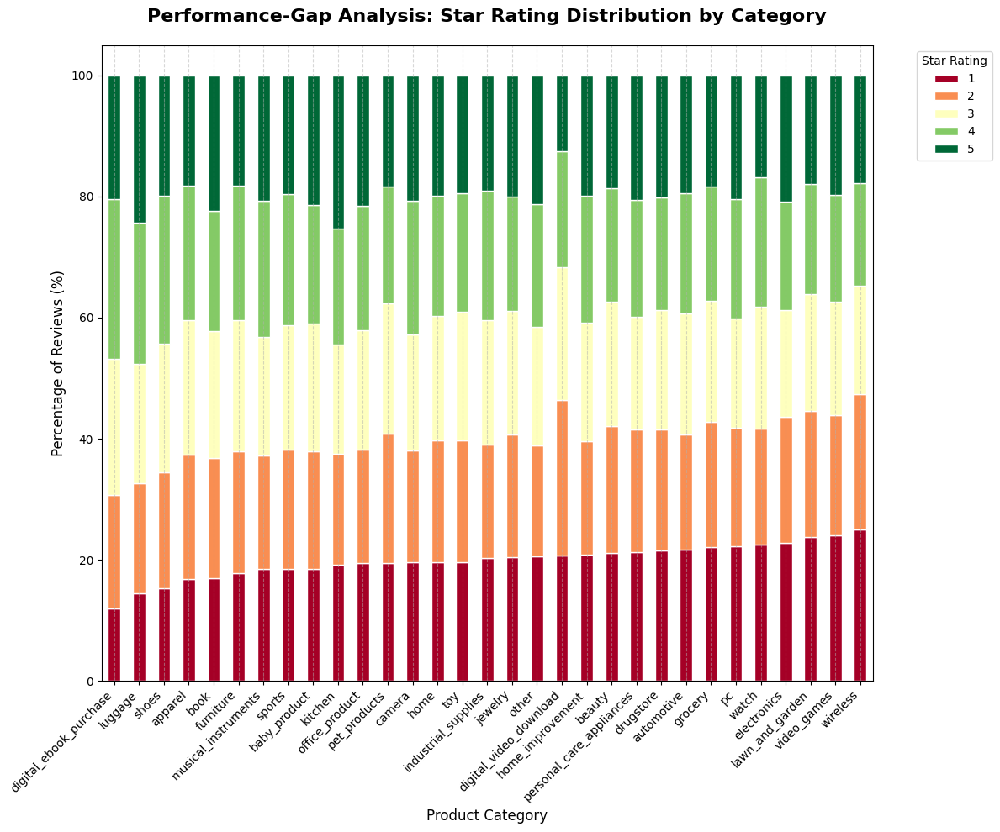
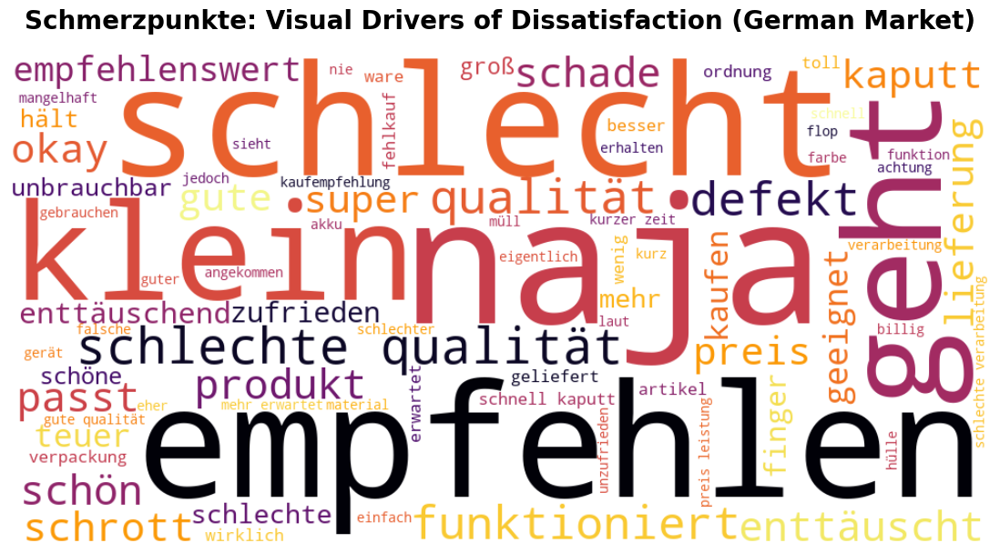
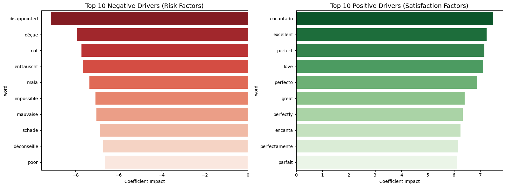

# Amazon Insight Engine: Globale Customer Experience Analyse 🚀

> **Data Science Case Study:** Analyse von 1,2M+ Kundenrezensionen zur Identifikation geschäftskritischer Treiber für Zufriedenheit und Umsatzoptimierung.

---

## 📌 Inhaltsverzeichnis
* [Projektübersicht](#-projektübersicht)
* [Zentrale Business-Fragen](#-zentrale-business-fragen)
* [Technologie-Stack](#-technologie-stack)
* [Datensatz-Beschreibung](#-datensatz-beschreibung)
* [Projekt-Workflow](#projekt-workflow)
* [Analyse-Ergebnisse & Erkenntnisse](#analyse-ergebnisse-und-erkenntnisse)


---

## 📊 Projektübersicht

**Problemstellung:** Unternehmen verlieren signifikante Umsatzanteile durch unerkannte Muster in negativen Bewertungen. Die Herausforderung liegt in der Skalierbarkeit der Analyse über mehrsprachige Märkte hinweg.

**Ziel:** Entwicklung eines Frameworks zur Identifikation von **Risikozonen** und zur prädiktiven Vorhersage negativer Kundenerfahrungen mittels NLP und Machine Learning.


---

## 💡 Zentrale Business-Fragen

1. **Risikozonen:** Welche Kategorien haben die höchste Negativ-Konzentration?
2. **Psychologie:** Korreliert die `review_length` mit extremen Sternebewertungen?
3. **Lokalisierung:** Wie unterscheidet sich der NPS (Net Promoter Score) zwischen Regionen?
4. **Semantik:** Welche Begriffe sind die stärksten Prädiktoren für Churn/Unzufriedenheit?
5. **Prediction:** Wie präzise lassen sich negative Erfahrungen vorab klassifizieren?


---

## 🛠 Technologie-Stack
* **Core:** `Pandas`, `NumPy`
* **Viz:** `Seaborn`, `Plotly`, `Matplotlib`
* **NLP:** `NLTK` / `Spacy` (Tokenisierung, N-Grams, Stopword-Removal)
* **ML:** `Scikit-learn` (Logistic Regression, Metric Evaluation)


---

## 📂 Datensatz-Beschreibung
* **Quelle:** The Multilingual Amazon Reviews Corpus
* **Umfang:** 1.264.107 Rezensionen
* **Märkte:** DE, EN, FR, ES, ZH, JP
* **Features:** `stars`, `review_body`, `review_title`, `product_category`, `language`


---

## Projekt-Workflow

### Phase 1: Daten-Audit & Performance-Optimierung
* **Konsolidierung:** Merge von Train/Test/Validation zu einem Master-Dataset (1.2M+ Zeilen).
* **Memory Management:** Downcasting von Datentypen (`int8`, `category`) zur Reduktion des RAM-Verbrauchs um bis zu 70%.
* **Cleaning:** Behandlung von NaNs und technischen Artefakten.

### Phase 2: Explorative Datenanalyse (EDA)
* **Benchmark:** Visualisierung von Performance-Gaps zwischen Kategorien.
* **Global Sentiment:** Cross-Market Analyse der Kundenzufriedenheit.
* **Statistik:** Korrelationsmatrix zwischen Metadaten und Ratings.

### Phase 3: Feature Engineering
* Generierung von Text-Metriken (Wortanzahl, Satzstruktur).
* **Target Labeling:** Transformation der Ratings in binäre Klassen (Positiv/Negativ).

### Phase 4: NLP & Semantic Mining
* Extraktion von Schmerzpunkten mittels **N-Gram-Analyse**(DE).
* Visuelle Identifikation von Treibern via WordClouds (DE).
* Global Expansion: Vergleichende semantische Analyse der restlichen 5 Märkte (EN, JA, FR, ES, ZH) zur Identifikation universeller Muster.

### Phase 5: Predictive Modeling & Action Plan
* Training einer Logistischen Regression.
* Ableitung von Strategien zur Steigerung der Conversion-Rate.


---

## Analyse-Ergebnisse und Erkenntnisse

 *Phase 1: Datenqualität & Performance*

* **Datenqualität:** Erfolgreiche Validierung von **1,26 Mio. Datensätzen**. Vollständige Bereinigung von 46 fehlenden Werten und technischen Artefakten (`Unnamed: 0`).
* **Effizienz:** Implementierung von **Memory-Management-Strategien** (`int8`, `category`). Dies garantiert eine performante Verarbeitung der Big Data Bestände und reduziert den RAM-Verbrauch um **~70%**.
* **Integrität:** Sicherstellung einer konsistenten Datenbasis (0 Duplikate) als Fundament für alle weiteren statistischen Auswertungen.

*Phase 2: Explorative Insights (EDA)*

*   **Performance Gap:** Identifikation eines signifikanten Unterschieds von **12%** in der Kundenzufriedenheit zwischen den Kategorien. `Wireless` und `PC` wurden als kritische **Risikozonen** (~24% Negativ-Rate) eingestuft.



*   **Global Sentiment:** Analyse der Marktverteilung (DE, EN, JP etc.). Feststellung einer künstlichen Daten-Balance (exakt **20%** pro Sterne-Rating), was eine ideale, verzerrungsfreie Basis für das spätere Machine Learning Training bietet.
*   **Kunden-Psychologie:** Nachweis eines veränderten Schreibverhaltens bei Unzufriedenheit. Während 5-Sterne-Bewertungen mit durchschnittlich **18,26 Wörtern** am kürzesten sind, investieren enttäuschte Kunden (2-3 Sterne) mit ca. **23,7 Wörtern** deutlich mehr Aufwand in ihre Rezensionen.
> **Business Insight:** Unzufriedenheit ist "lauter" und detaillierter. Kurze Rezensionen sind ein Indikator für Kundenzufriedenheit, während längere Texte oft spezifische Prozess- oder Produktfehler beschreiben, die proaktiv angegangen werden müssen.

*Phase 3: Feature Engineering & Target Labeling*

*   **Text-Metriken:** Generierung neuer numerischer Features wie `review_length` und `title_length`. Diese dienen als Prädiktoren für das Modell und bestätigen statistisch, dass unzufriedene Kunden detaillierteres Feedback geben.
*   **Target Labeling:** Transformation der 5-Sterne-Skala in ein binäres Format (`is_positive`). 
*   **Daten-Struktur:** Erstellung einer stabilen Zielvariable mit einer Verteilung von **60% (Negativ)** zu **40% (Positiv)**, was eine optimale Basis für die Klassifizierung in Phase 5 bietet.
> **Resultat:** Die Daten sind nun strukturell für das Machine Learning vorbereitet. Die Kombination aus Textmetriken und binärem Label ermöglicht eine präzise Modellierung der Kundenzufriedenheit.

*Phase 4: NLP & Semantic Mining (Global Insights)*

*   **Semantische Treiber (DE):** Die N-Gram-Analyse identifizierte `"schlechte qualität"` und `"schnell kaputt"` als die mit Abstand stärksten Prädiktoren für Unzufriedenheit. Dies deutet auf kritische Mängel in der Produkthaltbarkeit hin.
*   **Visuelle Analyse:** Die WordCloud bestätigt die Dominanz von Begriffen wie **"Defekt"**, **"Schrott"** und **"Enttäuscht"**. Auffällig ist auch das Wort **"klein"**, was auf Diskrepanzen zwischen Produktbildern und der Realität hinweist.



*   **Globale Konsistenz:** Die Expansion auf die Märkte EN, JA, FR, ES und ZH zeigt ein universelles Muster: Begriffe wie *"Quality"*, *"Qualité"*, *"Calidad"* und *"质量"* (Zhìliàng) führen weltweit die Negativ-Listen an.
> **Business Insight:** Kundenzufriedenheit ist kein kulturelles, sondern ein produktbezogenes Thema. Da die "Pain Points" weltweit identisch sind (Materialqualität & Defekte), können Qualitätsverbesserungen zentral gesteuert werden und werden eine positive Wirkung auf allen 6 Weltmärkten gleichzeitig haben.

*Phase 5: Predictive Modeling & Strategic Action Plan*

*   **Modell-Performance:** Implementierung einer Logistischen Regression, die eine **Gesamtgenauigkeit von 77%** erreicht. Besonders hervorzuheben ist der **Negative Recall von 92%** – das Modell identifiziert nahezu jede kritische Kundenbeschwerde zuverlässig.
*   **Prädiktive Asymmetrie:** Bestätigung der Hypothese aus Phase 2: Unzufriedenheit ist linguistisch "strukturierter". Das Modell lernt negative Muster (Recall 92%) deutlich effektiver als positive (Recall 53%), da enttäuschte Kunden präzisere Schmerzpunkte artikulieren.



*   **Globale Treiber:** Die Identifikation von universellen Prädiktoren wie `"disappointed"`, `"enttäuscht"`, `"déçue"` und `"mala"` beweist, dass die Modelllogik über Sprachgrenzen hinweg stabil bleibt. Begriffe wie `"impossible"` und `"poor"` wurden als systemische Warnsignale für Funktionsausfälle isoliert.

> **Business Action Plan:** 
> 1. **Early Warning System:** Integration des Modells zur automatischen Flaggen von "High-Risk"-Rezensionen (92% Erkennungsrate) für sofortige Interventionen des Kunden-Supports.
> 2. **Zentralisierte Qualitätssteuerung:** Da die Unzufriedenheit weltweit die gleichen Treiber hat (Qualität & Defekte), können Optimierungsmaßnahmen zentral gesteuert werden, statt sie lokal für jeden Markt zu fragmentieren.
> 3. **Proaktives Reputationsmanagement:** Durch die gezielte Analyse von Begriffen wie „schade“ oder „déconseille“ können Marketing- und Produktteams Diskrepanzen zwischen Kundenerwartung und Realität minimieren, bevor diese den NPS nachhaltig schädigen.

## 🏆 Fazit
Dieses Projekt demonstriert die erfolgreiche Skalierung von NLP-Analysen auf Millionen von Datensätzen. Durch die Kombination aus **Memory Management**, **multilingualem Semantic Mining** und einem **High-Recall-Modell (92%)** wurde ein Framework geschaffen, das globale Schmerzpunkte identifiziert und automatisierte Lösungen für den Kundensupport ermöglicht.


## Setup

Klone das Repository
```bash
# Repository klonen
git clone https://github.com/anhelinamoroz20-cell/DPP-1
cd DPP-1
```


Installiere [uv](https://uv.dev) (falls noch nicht installiert) und synchronisiere die Abhängigkeiten
```bash
# Dependencies installieren
uv sync
```

### Ausführung

Notebooks in dieser Reihenfolge ausführen:
1. notebooks/Amazon Reviews Multilingual.ipynb
